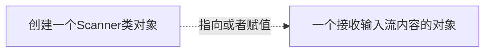
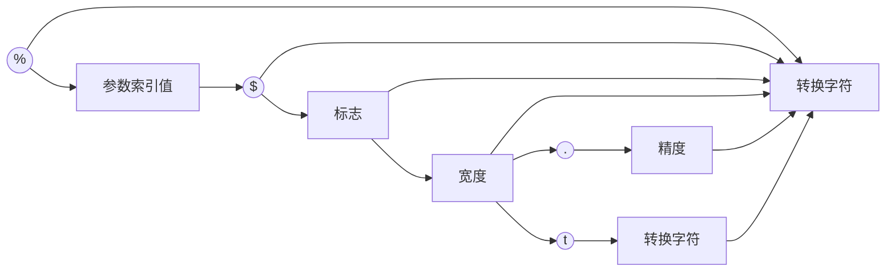

# 【JAVA核心技术】之JAVA的基本程序设计结构

## 一个最基本的JAVA程序结构构成

```java
package ...
import...

public class Firstsample {
    public static void main {
        System.out.println("helloworld");
    }
} 
```
## JAVA与C或C++语言中的相同与不同

### JAVA关键字

1. 48个关键字： abstract、assert、boolean、break、byte、case、catch、char、class、continue、default、do、double、else、enum、extends、final、finally、float、for、if、implements、import、int、interface、instanceof、long、native、new、package、private、protected、public、return、short、static、strictfp、super、switch、synchronized、this、throw、throws、transient、try、void、volatile、while
2. 2个保留字：goto const
3. 3个特殊直接量： true false null

### JAVA规范

1. 字节码文件名必须与class类名相同
2. 类的源文件中必须包含一个main方法
3. 书写规范可参照C或C++规范


#### JAVA方法(函数)的使用

`System.out.println`这句是指：使用了System.out对象调用了它的println方法。

Java的通用语法是：object.method(parameters)


## JAVA的输入和输出

想要在java中进行输入和输出，首先需要构造出一个Scanner对象，并将该对象与标准输入流（System.in）进行对接。

也就是这一步`Scanner in = new Scanner(System.in);`

进行输入时，需要有 `String word = in.nextLine();`

​							或者 `String word = in.next();`

通过上面的例子可以看出，java的输入需要经过**3个步骤**



### 关于点运算符

很多输入输出的语法例子可以看出，点运算符在java中运用的十分广泛。如：

`System.out.println();` `in.nextLine()` `java.util.Scanner`

可以看出，在方法调用中有着不同的表示含义：

1. 某个类的对象.类方法
2. Package.Class.Method

### 关于输入

#### Scanner基本用法

通常的:

```java
Scanner s = new Scanner(System.in);
String word = s.next();//或者String word = s.nextLine();
```

//以下表达暂且忽略

但是这样的表达通常局限于输入时的结束限制符（next为空格，而nextLine为回车等等）。而使用Scanner的useDelimiter方法可以自己规定以什么为界定控制输入。

```java
Scanner s = new Scanner(System.in).useDelimiter("\\s*h\\s*");//注1
```

这样的；一个scanner对象s表示：从标准输入流中截取一段字符（串），若出现'h'则从其前一字符截断存入对象s中。（'*'表示正则表达式\s中的内容可省略


##### Scanner对象的复用性

在我一开始学习这部分时，我就在想Scanner对象能否重复使用的问题。

通过下面这个例子就可以清楚的了解Scanner是否能重复使用这一特性：

```java
Scanner s = new Scanner(System.in);
        String word = s.next();
        String word2 = s.nextLine();
        System.out.println(word);
        System.out.println(word2);
/*输入：
hello helloworld
输出：
hello
 helloworld
*/
```

一个关于hasNext()的用法：

```java
String word1 = "helloworld";
        Scanner s = new Scanner(word1);
        String word = s.next();
        System.out.print(word);
        if (s.hasNext()) {
            String word2 = s.next();
            System.out.print(word2);
        }
        s.close();
```

### 关于输出

#### printf方法特性




#### 输出时间

```java
import java.util.Date;
System.out.printf("%tc", new Date());
```


### 文件的输入输出(暂不参考)

文件的输入输出与控制台的输入输出差别不大

#### 读取

```java
Scanner in = new Scanner(Paths.get("file.txt"), "UTF-8");
```

这里get到的路径可以是绝对路径也可以是相对路径，而对于字符编码则尽量指定。

##### 如何获取集成开发环境中的路径？

```java
String dir = System.getProperty("user.dir");
System.out.print(dir);
```

为了避免出现在一个不存在的文件中构造scanner类对象等问题，需要在main方法中标记：

```java
Public static void main(String[] args) throws IOException
```

#### 写入

写入文件需要先构造一个PrintWriter对象，并在构造器中提供文件名：

```java
PrintWriter out = new PrintWriter("test.txt", "UTF-8")；
```


## JAVA控制流程

### JAVA多重选择（switch case

java中的switch与c/c++十分相似

case 标签可以是：

1. char 、byte、short、int的常量表达式
2. 枚举常量
3. 字符串字面量


### 终端控制流程语句

带标签的break：

可以直接跳出多重循环

```java
		int i = 0;
        int u = 0;
        ceshi:{
            for (i = 0; i < 10; i++) {
                for (u = 0; u < 10; u++) {
                    if (u == 2) {
                        break ceshi;
                    }
                }
            }
        }
        System.out.printf("%d %d", i, u);
```

值得注意的是：标签可以适用于不局限于循环控制。


## 数组

### 数组的声明与创建

```java
int[] a;//声明
int[] a = new int[100];//创建 动态分配
int[] a = new int[]{1,2,3,4};//静态分配
```

当成功创建一个数组时，java会因不同的数组类型进行自动初始化：

- 数字数组中 元素初始化为0
- boolean数组中 元素初始化为false
- 对象数组中 元素则会被初始化为null


### 越界提示

当超出创建范围，程序触发 `array index out of bounds` 异常而终止执行

#### 如何获取元素个数？

array.length

```java
String[] a = new String[10];
        for (int i = 0; i < a.length; i++) {
            System.out.println(i);
        }
```

### 注意事项

1. 值得注意的是，java中的数组在进行创建之后将不能改变其大小，（但可以改变单一某一元素的大小）。但就像c语言中的malloc一样，可以在运行过程中扩展数组的大小（数组列表


### for each 对数组的循环

相当于for在java中的另一个用法，更像枚举。

```java
int[] a = new int[]{1, 2, 3, 4};
        for (int x : a) {
            System.out.println(x);
        }
```


### 匿名数组

主要用法就是重置某个数组

```java
new int[] {1, 2, 3};
smallPrimes = new int[] {1, 2, 3, 4, 5};
```

### 长度为 0 的数组

在编写一个结果为数组的方法时，如果碰巧结果为空，可以创建一个长度为0的数组。

`new elementType[0]` //0 与 null不同


### 数组排序

java的**util.Arrays**包中给出了一个快排模板：

```java
/*
此程序 给定一个原始数组，元素为1~n-1。
另给定一数组存放进行随机抽取原始数组中的元素，并将其排序输出
*/
		Scanner in = new Scanner(System.in);
        System.out.print("How many numbers do you need to draw? ");
        int n = in.nextInt();
        System.out.print("What is the highest number you can draw? ");
        int k = in.nextInt();

        int[] numbers = new int[n];
        for (int i = 0; i < numbers.length; i++)
            numbers[i] = i + 1 ;

        int[] result = new int[k];
        for (int i = 0; i < result.length; i++) {
            int r = (int) (Math.random() * n); 
            result[i] = numbers[r];

            numbers[r] = numbers[n - 1];
            n--;
        }

        Arrays.sort(result);
        System.out.println("Bet the following combination. It'll make you rich!");
        for (int r : result)
            System.out.println(r);
```

### 二维数组

java中的二维数组声明：

```java
double[][] balances = new double[10][6];
```

**相当于**c++中的

```c++
double** balances = new double*[10];
```

意思是：分配了一个包含10个指针的数组，数组中的每一个元素被填充了一个包含6个数字的数组。


