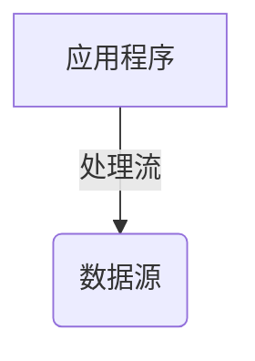

# 【JAVA程序设计】之IO流

> JAVA中的IO流是实现输入输出的基础，在 java 中把不同的输入输出源（键盘、文件、网络连接等）抽象表述为“流”（stream）。stream 是从 起源（source）到 接收（sink）的有序数据

java.io包

## 流的分类

1. 输入输出流：

   - 数据从 内存 到 硬盘，称为输入流。（这里的输入是指程序运行所在的内存的角度来划分的）
   - Server端的内存负责将数据输出到网络里，Server端的程序使用输出流；Client端的内存负责从网络中读取数据，为输入流

   Java中的输入流主要由 **InputStream** 和 **Reader** 作为基类，输出流主要为 **OutputStream** 和 **Writer** 作为基类。**都是抽象基类**

2. 字节流和字符流

   区别：

   ​	字节流：

   - 操作数据单元是 **8位** 的 **字节**

   - 由 **InputStream** 和 **OutputStream** 作为基类

   ​	字符流：

   - 数据单元为 **16位** 的 **字符**
   - 由 **Reader** 和 **Writer** 作为基类

3. 节点流和处理流

   按照流的角色分

   > 可以从/向一个特定的IO设备（磁盘、网络）读/写 数据的流， 称为 **节点流（低级流）**
   >
   > 处理流则用于对一个已存在的流进行 **链接** 或 **封装** ，通过封装后的流来实现数据的读写功能。也成为 **高级流**

## 流的概念模型

IO流中涉及到的基本上所有类都由 上述 4个抽象基类 中派生来的。

### 水管（输入设备和输出设备

- **输入流** 使用 隐式的 记录指针 来表示当前正准备从哪个 “水滴” 开始读取。每当取出一个或多个“水滴” 后，记录指针**自动向后移动** 。除此之外 还有一些方法 来控制 记录指针 的移动
- **输出流** 就像一个空的水管，每输出一个或多个水滴后，记录指针自动向后移动。

### 处理流

1. 性能的提高：增加缓冲提高效率
2. 操作的便捷：便捷的方法 处理 大批量 的内容
3. 可嫁接在任何已存在的流的基础之上

