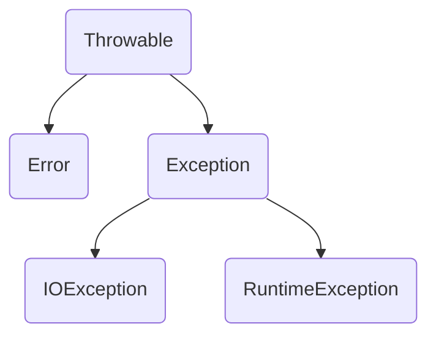

# 【JAVA核心技术】之异常、断言和日志

## 异常

所有异常对象都继承于 Throwable 类 




### 受查异常和非受查异常

- **非受查异常** 就是指 Error 或 RuntimeException 类的异常或系统错误，**通常情况下，RuntimeException都是自己的问题而非计算机或编译器的问题**。如下：

1. 错误类型转换
2. 数组越界
3. 访问null指针

- **受查异常** 也是这里需要**着重考虑**的异常情况，即 IOException 类异常。这类异常通常包括：

1. 打开子虚乌有的文件
2. 访问文件末尾之后的数据
3. 试图根据给定的字符串查找Class对象，而这个字符串表示的类并不存在。


我想说的是，**受查异常**就是关注的焦点，也是后续可抛的对象。第一次写的时候犯了个比较严重的错误，直接把非受查异常 throws 了。这是一个非常不好的习惯，同样也适用于 Error 类系统错误


### 抛出与捕捉异常

- **抛出**：

如果在执行某项危险方法前（即方法中的某些调用可能会导致出现 Exception）**预感到可能会出现异常**，可以选择将这个异常抛出: 

在类最后加上 Throws WhatkindofException


- **捕捉**：

在执行这个操作时**预感到可能会出现异常状态**，当然也可能不会，就将这个操作放置在 try 块中。

```java
int[] a = new int[10];
try{
    a[10] = 10;
}
catch(ArrayIndexOutOfBoundsException e){
    System.out.println("outofbounds!");
}
catch(NullPointerException e) {
    System.out.println("nullpointer!");
}
```


这时就会捕捉到异常，并且是第一个 catch 所捕捉到的数组越界异常。当然在捕捉到后会执行 catch 中的代码块，然后直接跳过剩下的 catch。


**Tips：**

- 类和方法都能抛出异常


### 什么时候应该在方法声明中抛出异常

1. 类方法中使用 throw 抛出异常时
2. 在方法中调用一个可能会抛出异常的方法或对象时
3. 程序出现错误，即出现 **非受查异常** 
4. java虚拟机和运行时库出现的内部错误


### 捕捉与抛出同时使用

1. catch 到之后进行记录，再抛出
2. catch 到之后抛出一个新的异常


**若某个方法可能会导致异常出现，就一定要在函数头以 throws 标记出**


### finally子句

不管异常是否被捕获，finally 都会执行


### 解耦合操作

如果在一个程序中的相邻的两个操作都会抛出相同的异常，那么就可以进行解耦合操作：

```java
InputStream in = ...
try{
    try{
        doing things;
    }finally{
        in.close();
    }
}
catch(IOException e){
    doing somethingelse;
}
```


## 日志

### 全局日志记录器（global logger

可以生成简单的日志记录（基本日志


### 高级日志

企业级日志


